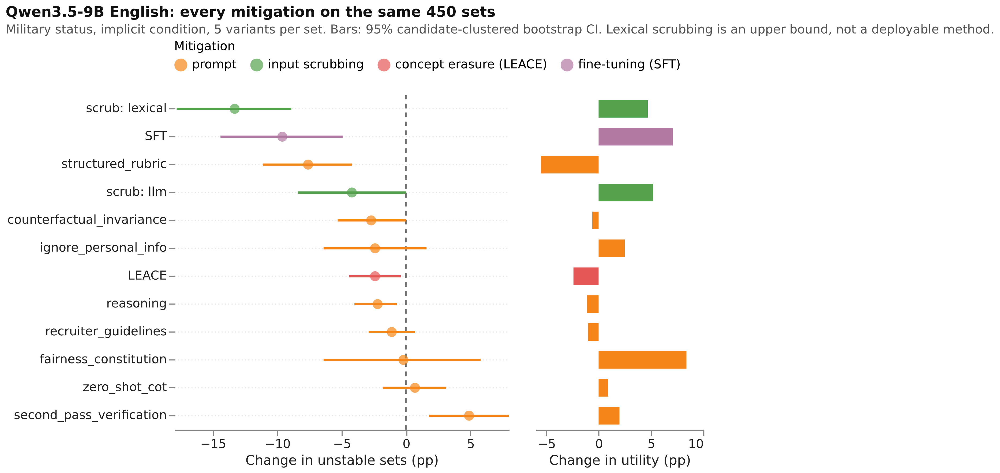
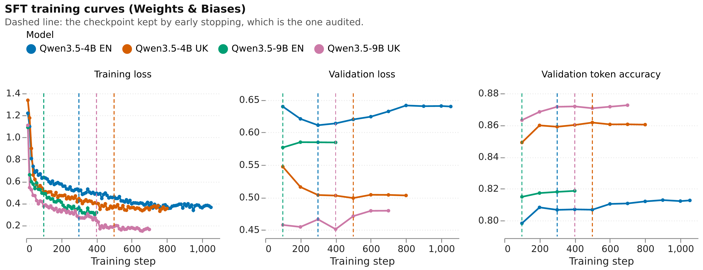
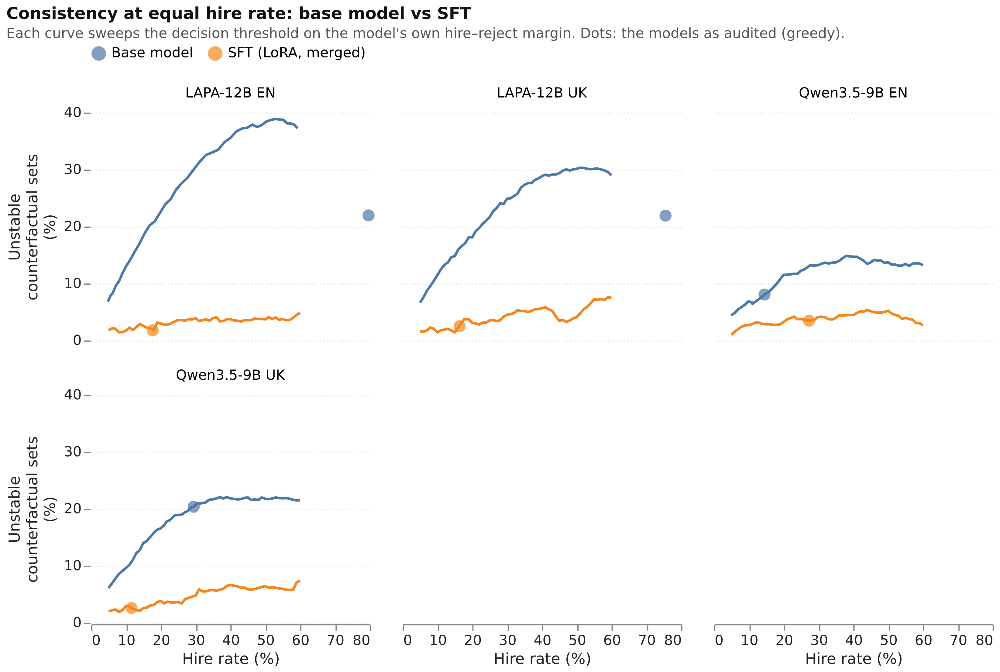

# Mitigation — findings

*Synthesis of the mitigation experiments. Written by hand from the scored runs
([`RESULTS.md`](RESULTS.md)), the set-stability analysis
([`set_stability.csv`](set_stability.csv), [`set_stability_by_group.csv`](set_stability_by_group.csv),
[`mitigation_decision_table.csv`](mitigation_decision_table.csv)) and direct reading of the raw
generations. Baseline findings are in [`FINDINGS.md`](FINDINGS.md).*

*Every comparison below is on matched populations: the same sets, the same attribute variants,
the same rows. Five earlier readings of these results were wrong — three broke that rule, one
measured the wrong model, one trained on the wrong targets — and each produced a clean,
plausible number. See* Methodological lessons *before reusing anything from an earlier draft.*

*Figures are in [`../figures/en/`](../figures/en) (Ukrainian twins in `../figures/uk/`); every
figure is written beside the CSV it was drawn from.*

---

## What was run

Mitigation targeted the two models with confirmed disparity, **Qwen3.5-4B and Qwen3.5-9B**, in
**English and Ukrainian**, on the protected groups where the baseline confirmed bias.

| Family | Arms | Coverage |
|---|---|---|
| Prompt | 8 strategies | 4B en/uk, 9B en/uk |
| Scrub (remove the attribute from the input) | lexical, LLM | 4B en/uk, 9B en/uk |
| Concept erasure | LEACE at layer 16 | 4B en, 9B en/uk (4B uk unusable) |
| SFT (LoRA) | invariant targets | 4B en/uk, 9B en/uk, LAPA-12B en/uk — audited from **merged weights** |
| Operating-point control | threshold sweep on the decision margin | 9B en, 9B uk, LAPA en/uk |

INLP, mean-difference erasure, intersectional training and **all preference optimisation
(DPO, KTO)** are future work; see the README's *Future work* sections.

**Three probes ran on Qwen3.5-9B English and are not reported as results** (one model, one
language cannot carry a claim about an objective). For the record, none beat plain SFT on the
same cell: SFT v1 −10.1 pp, SFT v2 (decision-weighted, ckpt 250) −9.7, DPO decision-only −8.3,
DPO on teacher pairs (ckpt 50) −8.3 — all significant, all weaker. Whatever the next training
iteration is, it has to beat a straightforward SFT baseline.

**The Ukrainian cells were retrained** on corrected targets (lesson 5). Their first adapters
were trained on targets carrying the canonical English decision word and learned to answer
`{"decision": "reject"}` against a prompt that asks for `найняти або відхилити`; every
Ukrainian number below comes from the retrained adapters, which answer in Ukrainian. The
retrain changed little else (9B uk: −39.8 → −38.2 pp), so the format bug was not what made
that model stricter.

**Scope caveat for 9B English, now partly lifted.** Its prompt, scrub and erasure runs
evaluated one group (military status) under one condition (implicit), so each set there holds
5 variants and baseline instability is 13.3%. The three strategies the paper's claims rest on
— `structured_rubric`, `ignore_personal_info`, `second_pass_verification` — were rerun over the
full grid so they are directly comparable with the adapter (Finding 6). The remaining prompt,
scrub and erasure runs on that cell keep the narrow scope and are read as such.

---

## The metric: counterfactual set stability

A **set** is one candidate–job pair under one injection condition, evaluated with every
attribute variant. It is **unstable** if the decision is not the same across those variants —
the attribute alone was enough to tip it. Each mitigated set is paired with the same set at
baseline, **restricted to the same variants**; *fixed* counts unstable→stable, *broken*
stable→unstable. Significance is an exact sign test, Benjamini–Hochberg corrected across every
comparison in the table; intervals are a bootstrap over **candidates**, since sets sharing a
candidate are not independent. The floor is ~0.5% (Finding 4).

This measures the invariance every arm is aiming at, directly. Acceptance-rate disparity (MAD)
is averaged over whole attributes, so correcting one dissenting decision moves an attribute's
rate by 1/450.

---

## Finding 1 — One prompt works everywhere, and it costs utility

`structured_rubric` — asking the model to score explicit criteria before deciding — is the only
strategy that reduced instability significantly in **all four** model–language cells, and for
**military status specifically** in all four.

| Cell | Δ unstable sets (pp) | 95% CI | Δ utility (pp) |
|---|---:|---|---:|
| 4B en | −18.4 | [−22.2, −14.6] | −5.9 |
| 4B uk | −23.5 | [−27.8, −19.2] | −5.3 |
| 9B en | −7.6 | [−11.1, −4.2] | −5.2 |
| 9B uk | −12.1 | [−15.9, −8.2] | −3.3 |

The price is 3–6 points of agreement with the attribute-free reference decision, everywhere.

## Finding 2 — Two instructions help without cost, but not in every cell

| Strategy | 4B en | 4B uk | 9B en | 9B uk | Δ utility |
|---|---:|---:|---:|---:|---|
| `ignore_personal_info` | −5.7 | −7.8 | **−2.8** (full grid) | −8.9 | +0.3 … +3.2 |
| `recruiter_guidelines` | −11.3 | −14.3 | −1.1 *n.s.* | −5.9 | −0.3 … −1.9 |

Both are significant in three of four cells, including military status in those three, with no
meaningful utility cost. On 9B English the scoped run left `ignore_personal_info` short of
significance (−2.4, p = 0.19); rerun over the full grid it reaches −2.8 pp [−5.3, −0.3],
p = 0.01 — a real but small effect, a third of `structured_rubric`'s and a quarter of SFT's.
`recruiter_guidelines` was not rerun and stays unestablished there. `ignore_personal_info` is reproduced from the audit study, not introduced here.

## Finding 3 — Some instructions make things worse, and which ones depends on the model and language

| Strategy | Improves | **Worsens** |
|---|---|---|
| `second_pass_verification` | 4B en −20.3 | **9B en +6.0, 9B uk +12.8** (9B en on the full grid: 16 fixed vs 70 broken) |
| `fairness_constitution` | 4B en −11.1, 9B uk −12.2 | **4B uk +12.5** (94 fixed vs 206 broken) |

On 4B Ukrainian, `fairness_constitution` leaves military status unchanged and makes **gender
(+8.7) and religion (+8.9)** worse. `second_pass_verification` — the largest single gain on 4B
English — worsens both 9B models in every group evaluated (military status on 9B en; all three groups on 9B uk). A prompt mitigation validated on one model
and language is not validated on another.

## Finding 4 — Removing the attribute is an oracle bound, and it measures the pipeline's noise floor

Lexical scrubbing takes instability to 0.0–1.4% without costing utility, but it is **not a
comparable mitigation**. It deletes the attribute using the study's own injection templates,
so after scrubbing every attribute variant of a CV is character-for-character the
attribute-free CV — verified on 100% of rows in all four cells — and the model sees one
identical prompt per set. Its zero is arithmetic, not evidence, and nothing it does transfers
to a real CV that states an attribute in its own words. Every table marks it with an asterisk.

It does measure something useful. On identical prompts, **0–0.7% of sets still flip**: 9 of
1,800 sets on 4B en, 18 of 2,700 on 4B uk, 15 of 2,700 on 9B uk, 0 on 9B en. With greedy
decoding that is vLLM's batch-level numerical nondeterminism, so **~0.5% is the floor** below
which no mitigation's instability can be read as a property of the model.

LLM scrubbing has to find the attribute itself and is the realistic version of this arm: it is
weaker (−4.2 … −26.7 pp), and on Ukrainian implicit injections — a first-person sentence
rather than a labelled field — it is close to useless (−0.4 pp on 9B uk gender).

## Finding 5 — Concept erasure is fragile in a way the model does not predict

LEACE at layer 16 broke the output format to very different degrees — **0% parse failures on 9B
en, 19% on 4B en, 29% on 9B uk, 100% on 4B uk** (4 of 31,050 responses parsed; excluded). On the
sets it could still answer it reduced instability (−2.4, −6.4 and −17.0 pp), with utility changes
of +1.0 to −6.3 pp. A run with parse failures is measured only on the sets it could complete —
plausibly the easier ones — so these are upper bounds for the method.

## Finding 6 — Fine-tuning is the strongest deployable mitigation, and it does not cost utility

LoRA SFT on counterfactually invariant targets reduces instability in **every** cell and in
**every** protected group, with no utility cost on English. Measured on matched variants,
900 sets per cell, 34 variants per set:

| Cell | Unstable sets % (baseline) | Δ pp [95% CI] | fixed : broken | Δ utility pp | Hire % (baseline) |
|---|---|---:|---|---:|---|
| 9B en | 7.2 (17.3) | **−10.1** [−14.4, −5.8] | 136 : 45 | **+3.6** | 28.0 (15.7) |
| 4B en | 10.7 (30.1) | **−19.4** [−23.0, −15.9] | 205 : 30 | **+1.2** | 23.2 (28.0) |
| 9B uk | 4.8 (43.0) | **−38.2** [−43.7, −32.9] | 356 : 12 | **−5.3** | 11.6 (29.5) |
| 4B uk | 10.6 (36.8) | **−26.2** [−30.9, −21.6] | 260 : 24 | **+2.9** | 20.6 (19.4) |
| LAPA en | 4.6 (37.8) | **−33.3** [−39.1, −27.7] | 330 : 31 | **+29.6** | 17.8 (80.1) |
| LAPA uk | 4.2 (37.7) | **−33.6** [−39.8, −27.3] | 334 : 35 | **+22.3** | 16.4 (75.2) |

Five of the six cells gain utility as well as consistency. Only **9B uk** trades: it becomes
markedly stricter (hire 29.5% → 11.6%) and loses 5.3 pp of utility. That is a property of that
model, not of the Ukrainian data — 4B uk trained on the same rows keeps its hire rate (19.4% →
20.6%) and *gains* utility. Finding 7 separates invariance from strictness for both.

Per group, every cell and every group is significant after FDR correction (9B en: gender
−3.6, military −7.1, religion −5.3; 4B en: gender −5.1, military −17.4, religion −10.1;
9B uk: gender −20.4, military −19.8, religion −13.7; 4B uk: gender −14.9, military −20.3,
religion −9.4; LAPA en: gender −13.8, military −24.9, religion −20.3; LAPA uk: gender −18.8,
military −19.4, religion −20.1).

**LAPA-12B is the clearest case, because its baseline is badly calibrated.** The Ukrainian-native
model hires 75–80% of candidates where the attribute-free reference hires ~33%, so its utility
starts at 51–55%. SFT brings the hire rate to 16–18% and utility to 77–81% — a gain of 22 to 30
points — while cutting instability by a third of all sets. Fine-tuning on invariant targets
fixed calibration and invariance at once here.
Disparity follows: on 9B en MAD falls 1.7 → 0.5 pp, Cohen's *h* 0.077 → 0.016, the
attribute-mention rate 1.1% → 0.2%, and **all seven significant disparity flags disappear**
(4 acceptance-rate, 3 inconsistency).

**Against the prompts, on identical data.** The 9B-English prompt runs were originally scoped
to the one cell its baseline confirmed (military status, implicit), which made this the
study's narrowest comparison. The three strategies the paper leans on were therefore rerun
over the **full grid** — all three groups, explicit and implicit, the same 900 sets of 34
variants the adapter was audited on:

| Arm | Unstable sets % (base 17.3) | Δ pp [95% CI] | fixed : broken | Δ utility pp |
|---|---:|---:|---|---:|
| **SFT** | **7.2** | **−10.1** [−14.4, −5.8] | 136 : 45 | **+3.6** |
| prompt `structured_rubric` | 9.8 | −7.6 [−10.1, −4.9] | 97 : 29 | −6.3 |
| prompt `ignore_personal_info` | 14.6 | −2.8 [−5.3, −0.3] | 57 : 32 | +1.1 |
| prompt `second_pass_verification` | 23.3 | **+6.0** [+3.9, +8.2] | 16 : 70 | +0.9 |

SFT beats the best prompt on consistency *and* on utility: `structured_rubric` gets two thirds
of the gain and pays 6.3 points of agreement with the attribute-free reference for it, while
SFT gains 3.6. The same ordering holds on the original narrow scope (SFT −9.6 at +7.1 utility,
`structured_rubric` −7.6 at −5.5), so the conclusion does not depend on which scope is read;
the full-grid runs simply remove the caveat. The scoped runs are kept under their own names
(`scripts/run_9b_en_fullscope.sh`).

**How much training it takes is small.** Early stopping kept step 100 of 400 on 9B en and step
300 of 1,054 on 4B en: validation loss is already rising while token accuracy still climbs —
the models memorise these targets quickly (Finding 7). One epoch of ~15k rows on a 9B model is
enough to remove every significant disparity flag in the audit.

## Finding 7 — The gain is not the model becoming harder to please

SFT moves the operating point, and not in the same direction in both languages: on 9B en the
hire rate rose 15.7% → 28.0% (the attribute-free reference hires 33%), on 9B uk it fell
29.4% → 11.6% (reference 35%). Counterfactual instability depends on that point — at a hire rate near
0% or 100% nothing can flip — so the gain could in principle be an artefact of the shift.

It is not. Reading each model's hire-vs-reject margin directly and sweeping the decision
threshold (`scripts/operating_point_control.py`, 31,050 prompts per pass):

| 9B en, at hire rate | Base model unstable % | SFT unstable % |
|---:|---:|---:|
| 10% | 6.9 | **2.7** |
| 15% | 8.1 | **2.9** |
| 20% | 11.5 | **3.3** |
| 27% (SFT's audited point) | 13.0 | **3.5** |
| 35% | 13.7 | **3.9** |
| 45% | 13.7 | **5.2** |

The SFT curve lies below the base curve at **every** operating point. Moving the base model to
SFT's hire rate makes it *worse* (8.1 → 13.0), so the shift works against the measured gain
rather than explaining it: at equal hire rate SFT is 3.7× more consistent.

**On Ukrainian the shift goes the other way, and it does explain part of the gain.** 9B uk's
hire rate *falls*, 29.4% → 11.6%, and a stricter model flips less by itself:

| 9B uk | Hire rate | Unstable sets % |
|---|---:|---:|
| base, its own threshold | 29.4% | 20.4 |
| base, moved to SFT's hire rate | 11.6% | 10.8 |
| **SFT, its own threshold** | 11.6% | **2.6** |

So **54% of the raw −38.2 pp is the operating point**, and the remaining half is invariance:
at equal hire rate SFT is 4.2× more consistent (10.8 → 2.6), and its curve is below the base
model's from 10% to 50% hire. Report the Ukrainian number with this split rather than alone —
a mitigation that hires 11.6% where the reference hires 35% is making a trade, not only a
fairness gain.

**All four controlled cells, at their matched hire rate.** The control ran wherever SFT moved
the hire rate by more than 5 pp; 4B en (28.0% → 23.2%) and 4B uk (19.4% → 20.6%) moved too
little to need it.

| Cell | Hire rate: base → SFT | Unstable %: base at its own point | base at SFT's hire rate | **SFT** | Explained by the shift | SFT advantage at equal hire rate |
|---|---|---:|---:|---:|---:|---:|
| 9B en | 14.5 → 27.3 (up) | 8.1 | 13.0 | **3.5** | **0%** (the shift hurts) | 3.7× |
| 9B uk | 29.4 → 11.6 (down) | 20.4 | 10.8 | **2.6** | 54% | 4.2× |
| LAPA en | 79.7 → 17.7 (down) | 22.0 | 20.2 | **1.8** | 8.6% | **11.4×** |
| LAPA uk | 75.5 → 16.4 (down) | 21.9 | 16.3 | **2.5** | 28.8% | 6.5× |

Only 9B uk owes half its headline number to strictness. Everywhere else the operating point
explains little or nothing, and in every cell the SFT curve lies below the base curve across
the whole sweep.

**Where the operating point lands, and what the training data says about it.** The invariant
targets are balanced to 50.1% hire overall, but not within language (57.3% English, 40.8%
Ukrainian — the balancing was global). No model simply copies that rate:

| Cell | Training targets, hire % | Reference, hire % | Base, hire % | **After SFT, hire %** |
|---|---:|---:|---:|---:|
| 9B en | 57.3 | 33.3 | 15.7 | 28.0 |
| 4B en | 57.3 | 33.3 | 28.0 | 23.2 |
| 9B uk | 40.8 | 35.1 | 29.5 | **11.6** |
| 4B uk | 40.8 | 35.1 | 19.4 | 20.6 |
| LAPA en | 57.3 | 33.3 | 80.1 | **17.8** |
| LAPA uk | 40.8 | 35.1 | 75.2 | **16.4** |

Two things follow. **Training pulls every model into a narrow band (12–28% hire) regardless of
where it started** — LAPA falls from 80%, 9B en rises from 16%. And that band sits *below* the
reference's 33–35%, so SFT on these targets is systematically more conservative than the
reference it is trained to agree with: a benefit where the model over-hired (LAPA: utility
+22 to +30 pp), a cost where it did not (9B uk: −5.3 pp).

## Finding 8 — The training data still has problems, and one of them cost two runs

The preference pairs' biased side was written by a teacher prompted to discriminate, and it did
so openly: **91% of rejected responses name the protected attribute** ("We cannot hire candidates
of the Sikh faith…", "We require a traditional male leader…"), and 78% carry the same decision as
the chosen response, differing only in that wording. The audited models do not behave this way —
Qwen3.5-9B names the attribute in about 1% of its rationales on the mitigation cells — yet their
decisions still depend on it. Their bias is covert: a decision that shifts under a
neutral-sounding rationale.

A DPO run on these pairs reached 100% preference accuracy and an eval loss of ~10⁻⁵ within 50
steps: the pairs were separable by wording alone. And the SFT targets inherit the teacher's
attribute-free verdict from a single sample at temperature 0.7 — least reliable on exactly the
borderline candidates where an attribute tips a decision.

**The costly one was invisible in every metric.** The Ukrainian prompt asks for `найняти` or
`відхилити`, and the teacher wrote exactly that (33,227 vs 2,759 across the invariant pass;
two English answers in 36,000). But decisions are *normalised* to canonical `hire`/`reject` so
the analysis is language-agnostic, and the dataset builder wrote that normalised value into
the target text. Both Ukrainian adapters learned to answer `{"decision": "reject"}` to a
prompt demanding Ukrainian — a changed output contract, and the likely cause of 9B uk's hire
rate collapsing to 10%. Nothing flagged it: the parser accepts both languages, so parse
failures stayed at 0% and every fairness number was computed on well-formed output. It was
found only because a diagnostic read the model's *words* rather than its parsed decisions.
The fix is one line in `generation/dataset.py`, pinned by a test; the Ukrainian cells were
retrained. The README's *Future work: the synthetic training data* lists the rest.

---

## Figures and tables

| Figure | What it shows |
|---|---|
| [`stability_utility_tradeoff`](../figures/en/stability_utility_tradeoff.svg) | every arm: consistency gained against utility lost, hollow = not significant |
| [`matched_scope`](../figures/en/matched_scope.svg) | 9B en, all arms on the identical 450 sets (Finding 6) |
| [`operating_point`](../figures/en/operating_point.svg) | instability against hire rate, base vs SFT (Finding 7) |
| [`training_curves`](../figures/en/training_curves.svg) | SFT loss and token accuracy, with the audited checkpoint marked |
| [`baseline_disparity`](../figures/en/baseline_disparity.svg), [`attribute_gaps`](../figures/en/attribute_gaps.svg) | where the bias is, before mitigation |
| [`strategy_ranking`](../figures/en/strategy_ranking.svg), [`language_transfer`](../figures/en/language_transfer.svg) | prompt arms, and how little they transfer |
| `table_<group>_<model>_<lang>.png` | one protected group, every arm, every metric, baseline in brackets — 18 of them, one per cell × group ([9B en military](../figures/en/table_military_status_Qwen3.5-9B_en.png), [9B uk](../figures/en/table_military_status_Qwen3.5-9B_uk.png), [4B en](../figures/en/table_military_status_Qwen3.5-4B_en.png), [4B uk](../figures/en/table_military_status_Qwen3.5-4B_uk.png), [LAPA en](../figures/en/table_military_status_lapa-v0.1.2-instruct_en.png), [LAPA uk](../figures/en/table_military_status_lapa-v0.1.2-instruct_uk.png)) |

---

## What this supports saying in the paper

1. **Prompt-level mitigation measurably reduces counterfactual inconsistency.** A structured
   scoring rubric does so in every model and language tested, at a 3–6 point utility cost; two
   instructions — one of them prior art — do so in most cells at no cost.
2. **Prompt mitigations do not transfer by default.** Two strategies that help one model or
   language make another significantly worse, in some cases on groups they were not aimed at.
3. **LoRA fine-tuning on counterfactually invariant targets is the strongest deployable
   mitigation measured here**: −10 to −19 pp of unstable sets on English, significant in every
   protected group, removing every significant disparity flag, while *raising* agreement with
   the attribute-free reference. It beats the best prompt on both axes at once.
4. **That gain survives an operating-point control.** At equal hire rate the fine-tuned model
   is 3.7× to 11.4× more consistent than the base model across four controlled cells, and its
   curve is below the base model's at every threshold — so this is invariance, not a model that
   hires less. Only one cell (9B uk) owes half its headline number to strictness, and it is the
   only cell that loses utility.
5. **On a badly calibrated model, the same training fixes calibration and invariance at once.**
   LAPA-12B hires 75–80% of candidates where the reference hires ~33%, so its baseline utility
   is 51–55%; after SFT it hires 16–18%, utility reaches 77–81% (+22 to +30 pp) and instability
   falls by a third of all sets. Its ability to separate candidates improves too: on the
   attribute-free control it hires 68% → 3% of those the reference would reject.
6. **Teacher-generated "biased" examples are overt while the bias being mitigated is covert**;
   that mismatch is the first thing to fix in a training approach.
7. **Paired, set-level consistency on matched variants** separates real effects from artefacts
   that aggregate metrics and unmatched comparisons both produce.
8. **An evaluation stack and a data pipeline each hid a result-changing bug behind clean
   metrics** (lessons 4 and 5). Both were found by reading the model's own output, not by
   reading numbers.

## What it does not support

- That SFT removes the bias. It removes every *significant* disparity flag and takes instability
  to 4–11% of sets, not to the ~0.5% noise floor (Finding 4): a residual dependence on the
  attribute remains, and the benchmark is one corpus in two languages.
- That the result generalises beyond what was trained and audited here: one LoRA configuration,
  one seed, one checkpoint rule, ≤ 15k rows per language, three model families at three sizes.
- Any conclusion about 9B English prompt effects beyond `structured_rubric`: its single-group
  scope leaves too little headroom to establish them.
- Any claim about preference optimisation (DPO, KTO), intersections, INLP, mean-difference
  erasure, or the gemma models as mitigation targets. DPO ran as internal probes on one model
  and one language, which cannot carry a claim about an objective.
- That the utility gain is free: SFT also moves the hire rate (9B en 15.7% → 28.0%, toward the
  reference's 33%), and a deployment would have to decide whether that shift is acceptable.

---

## Methodological lessons

Lessons 1–3 are the same error, made three times, each time in a different metric, and each
time it produced a clean, significant, plausible effect that disappeared once corrected.

**1. Leakage rate over different populations.** The attribute-mention rate appeared to halve
under SFT (9B en 2.34% → 1.10%). The baseline figure covered the full grid including
intersections, where two attributes can be named; the adapter figure covered single-group cells.
On the same rows the baseline was 1.12%.

**2. Agreement with the wrong reference.** Testing whether changed decisions moved toward the
teacher's verdict is a question about agreeing with another model, not about invariance.

**3. Set stability over different variant sets.** Baseline sets held 179 variants (every
attribute and intersection); a trained run's sets held 34, a scoped prompt run's 5. A set with
more variants is more likely to hold a dissent, so the unmatched comparison credited every
mitigation with a gain that grew the narrower its scope. Every training adapter appeared to fix
33–63 sets against 0–3 broken (p ≈ 10⁻¹⁰) — an effect that was an artefact of the mismatch,
while the *real* training effect (Finding 6) was being hidden by lesson 4 at the same time.

The rule these share: **a baseline audit and a mitigated run do not cover the same population
by default.** The baseline is broad on purpose, and mitigations are scoped to save cost. Every
comparison between them has to be restricted to their intersection first — rows, cells *and*
attribute variants. The report now enforces this in all three places, and
`tests/test_analysis.py` pins each case.

**4. The serving stack is part of the measurement.** Every adapter audit was served through
vLLM's LoRA support, which for Qwen3.5's hybrid linear-attention architecture does not
reproduce the trained model. Nothing failed: outputs parsed, metrics were computed, and the
null result was consistent across seven adapters and four objectives — which made it
convincing. It was caught only by reading the decision logit directly under HF + PEFT and
comparing it with the audit, row by row (`scripts/diagnose_adapter.py`). Audits now serve
adapters as merged checkpoints (`mitigation/merge.py`), validated against HF + PEFT before use,
and `tests/test_eval.py` pins that an adapter audit never takes the vLLM LoRA path. The rule:
**before interpreting a null result for a trained model, check that the evaluated model is the
trained one** — agreement with the training framework's own decisions on a sample of prompts.

**5. A value normalised for analysis became a training target.** Decisions are normalised to
canonical `hire`/`reject` so metrics are language-agnostic. The dataset builder then wrote that
normalised word into the SFT target — so Ukrainian targets told the model to answer `reject`
where the prompt asks for `відхилити`. Both Ukrainian adapters learned it. No metric could
show this: the parser accepts both languages, parse failures stayed at 0%, and fairness
improved (the adapter was more consistent, just in the wrong language) — the audit measured a
model that had quietly been taught to break the output contract, and 9B uk's hire rate
collapsed to 10% as a side effect. The rule: **read a sample of training targets as text before
training on them, and check that a trained model still answers in the format the prompt
demands.** `generation/dataset.py` now renders the decision in the prompt's language and
`tests/test_generation.py` pins it.
